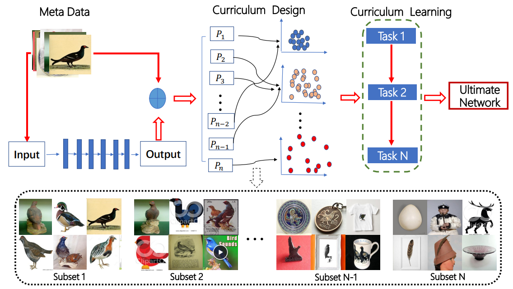

# CurriculumNet

## Introduction

This repo contains related code and models from the ECCV 2018 [CurriculumNet paper](https://arxiv.org/abs/1808.01097).

CurriculumNet is a new training strategy able to train CNN
models more efficiently on large-scale weakly-supervised web images, where no
additional human annotation is provided. By leveraging the idea of curriculum learning, we
propose a novel learning curriculum by measuring data complexity using cluster
density. We show by experiments that the proposed approaches have strong
capability for dealing with massive noisy labels. They not only reduce the negative
affect of noisy labels, but also, notably, improve the model generalization
ability by using the highly noisy data as a form of regularization. The proposed CurriculumNet achieved
the state-of-the-art performance on the Webvision, ImageNet, Clothing-1M and
Food-101 benchmarks. With an ensemble of multiple models, it obtained a Top
5 error of 5.2% on the Webvision Challenge 2017 ([source](https://www.vision.ee.ethz.ch/webvision/2017/challenge_results.html)). This result
was the top performance by a wide margin, outperforming second place by a nearly 50% relative error rate.

If you find the code or models useful in your research, please consider citing:

    @inproceedings{CurriculumNet,
        author = {Sheng Guo, Weilin Huang, Haozhi Zhang, Chenfan Zhuang, Dengke Dong, Matthew R. Scott, and Dinglong Huang},
        title = {CurriculumNet: Weakly Supervised Learning from Large-Scale Web Images},
        booktitle = {European Conference on Computer Vision (ECCV)},
        month = {September}
        year = {2018}
    }

## Guide

### Code

The code provided is an implementation of the paper's described density-based clustering algorithm to create the learning curriculum that measures the complexity of training samples using
data distribution density. It is provided as a Python module called [curriculum_clustering](curriculum_clustering/_curriculum_clustering.py).

For a usage example, please refer to the provided [test](curriculum_clustering/tests/test_via_webvision.py) which runs on a subset of WebVision data.

For parameters, please see the inline documentation of the [CurriculumClustering class](curriculum_clustering/_curriculum_clustering.py#L217).

### Models

The models provided are referenced in the paper's Table 5. [Learn more and download here](models).
